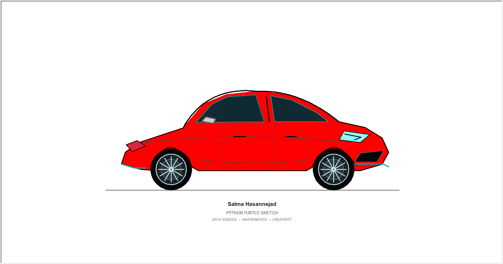

# Red Car Sketch with Python Turtle

A fun Python project where my little Turtle, **Salma**, sketches a red car from scratch. 🐢🚗

Yes, the turtle is named **Salma** too — same as me. 🐢

I made this as a creative break while working on data science and machine learning projects. It combines Python, geometry, coordinates, curves, and a little fun.

## Preview



## Features

- Animated Turtle drawing
- Custom red car design
- Bézier curves for smoother lines
- Reusable drawing functions
- PNG output of the finished sketch
- A visible Turtle named **Salma** doing the drawing

## Technologies

- Python
- Turtle Graphics
- Pillow

## Project Structure

```
python-turtle-car/
├── turtle_red_car.py
├── red_car.png
├── README.md
└── requirements.txt
```

## Run the Project

Install the required package:

```bash
pip install -r requirements.txt
```

Then run:

```bash
python turtle_red_car.py
```

The Turtle window will open and Salma will sketch the car.

## Author

**Salma Hasannejad**